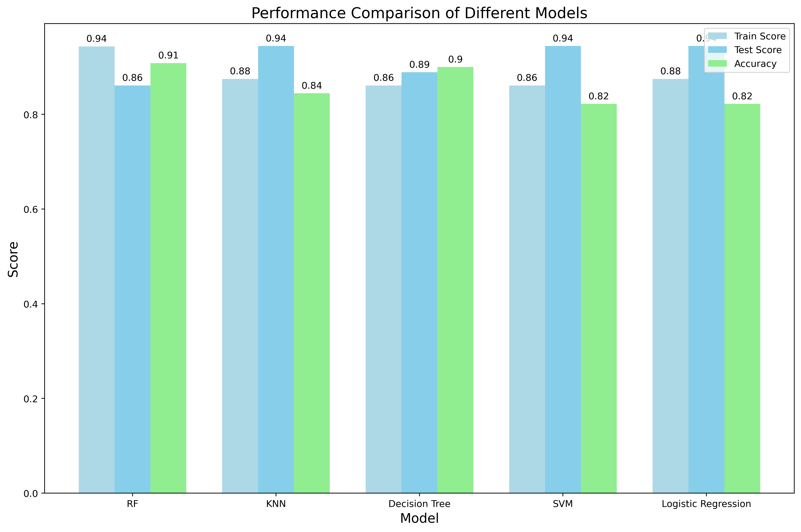
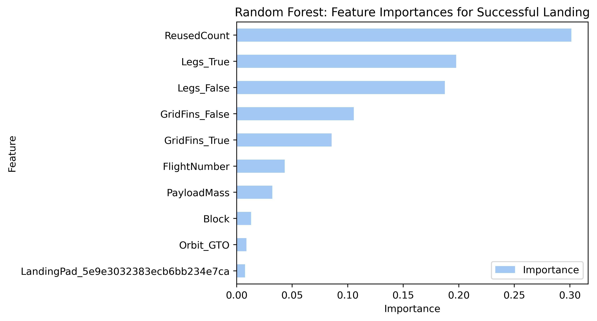

# Task008-P01-DS-SpaceX-Falcon-20240409
Predict successful landing 

    <h1> <a id="Obj1">🎯Objectives</a></h1>  
    
SpaceX advertises Falcon 9 rocket launches on its website for 62 million dollars, whereas other providers charge upwards of 165 million dollars each. The cost savings stem from SpaceX's capability to reuse the first stage. We will develop a model to predict the successful landing of the first stage, which will help estimate the launch cost for a bidding proposal.
    

Note: This project's dataset was created for pedagogical purposes and may not be indicative of Space X.

<ol>
    <li> Collect and make sure the data is in the correct format from an API.
    <li> Predict if the Falcon 9 first stage will land successfully.
</ol>
All documents are also available in the <a href="https://www.kaggle.com/code/wahyuardhitama/task008-p01-ds-spacex-falcon-20240409">Kaggle.</a>

<table style="color:black;
           display:fill;
           border-colapse: colapse;
           width: 100%;
           border: 1px solid black;
           border-collapse: collapse;
           border-style: solid;
           border-radius:5px;
           background-color:#5642C5;
           font-size:110%;
           font-family:Verdana;
           letter-spacing:0.5px">
            
  <h3 style = "text-align:center">Table 1.1. Classification Class </h3>
  <tr>
    <th>Landing Success (Class = 1)</th>
    <th>Crash Landing (Classs = 0)</th>    
  </tr>
  <tr style = "text-align:center">
      <td></td>
      <td></td>
  </tr>
  </table>

<b style = "font-family: Arial; font-size: 16px">Note:</b>
We must maintain objectivity when analyzing the data to gain valuable insights. This involves collecting, fact-checking, and challenging the data and other sources. Adopting a Genchi Genbutsu approach, which involves go-seeing for yourself or discussing with subject matter experts, allows us to delve into the data to gain firsthand understanding.

    
Data should adhere to the <b>COV-FAST</b> principles: Clear, Objective, Valuable, Focused, Agile, Scientific, and Time-bound. Additionally, consider exploring alternative models such as logistic regression, random forest, neural networks, or others.

    <h3>Framework and Methodologies</h3>
     A <b>methodology</b> offers <b>specific steps</b> for completing a project, while a <b>framework</b> provides broader guidance on tools, resources, and workflow processes. As an experienced Green Belt Lean Six Sigma professional, the methodology that I often use is DMAIC. I used PACE as a framework as I found it similar to <b>Knowledge Discovery in Databases (KDD)</b>. Both <b>PACE</b> and <b>KDD</b> aim to guide structured data projects. <b>PACE</b> specifically focuses on machine learning projects, whereas <b>KDD</b> covers a broader range of data discovery techniques.
     
<h3>Data Analysis PACE Steps:</h3>
   <ol style="font-family:Verdana; font-size:16px">
    <li> Plan/Prepare - import the relevant libraries and data</li> 
    <blockquote>
    <ol>Align project with business needs, requirements and contraints. Select an approriate machine learning model based on the problem and business context. KDD: Selection, Data Wrangling (Pre-processing and Transformation).
    </ol>
    </blockquote>
        <li>Analyze - Explarotary Data Analysis (EDA)</li>
    <blockquote>
    <ol> Understanding data for accurate predictions, focus on the response variable (what the model predicts) and leverage exploratory data analysis to uncover patterns and address irregularities. KDD: Data Mining.
     </ol>
    </blockquote>
    <li>Construct - model </li>
    <blockquote>
    <ol>Construct and evaluate model. KDD: Evaluation.
     </ol>
    </blockquote>
    <li>Execute - share</li>
    <blockquote>
    <ol>Interpret model and share the story. KDD: Communicate to stakeholders.
     </ol>
    </blockquote>

<h2>Table of Contents</h2>
    

<ol>
    <li><a href="#Obj1">Objectives</a></li>
    <li><a href="#Plan">Plan - import the relevant libraries and data</a></li>
    <ul>
        <li><a href="#Sel">Selection</a></li>
        <li><a href="#WS">Web Scraping</a></li>
        <li><a href="#DW">Data Wrangling</a></li>        
    </ul>
    <li><a href="#EDA">Explarotary Data Analysis (EDA)</a></li>
    <ul>
        <li><a href="#SQL">Analysis with SQL</a></li>
        <li><a href="#EDA_1">Explarotary Data Analysis (EDA)</a></li>
        <li><a href="#Inter_chart">Interactive Chart</a></li>
        <li><a href="#Feat">Feature Engineering</a></li>
        <li><a href="#Fol">Interactive visual analytics with folium</a></li>
        <li><a href="#Inter">Interactive dashboard on Website</a></li>
    </ul>
    <li><a href="#Construct">Construct - model</a></li>
    <ul>
        <li><a href="#Log_Reg">Logistic Regression</a></li>
        <li><a href="#SVM">Support Vector Machine (SVM)</a></li>
        <li><a href="#Tree">Decision Tree</a></li>
        <li><a href="#KNN">K Nearest Neighbours (KNN)</a></li>
        <li><a href="#RF">Random Forest (RF)</a></li>
    </ul>
    <li><a href="#Ex">Execute - share</a></li>
    <ul>
        <li><a href="#Sum">Summary </a></li>
    </ul>
</ol>

<h3 style = "text-align:center">Table 1.2. Project Charter</h3>
<table style="color:black;
           display:fill;
           border-colapse: colapse;
           width: 100%;
           border: 1px solid black;
           border-collapse: collapse;
           border-style: solid;
           border-radius:5px;
           background-color:#5642C5;
           font-size:110%;
           font-family:Verdana;
           letter-spacing:0.5px">
  
  <tr>
    <th colspan ="4" style="text-align:center">Project Launch Bids Ignition</th>
  </tr>
    <tr>
    <th colspan ="4" style="text-align:center">9th Apr 2024</th>
  </tr>
  <tr>
      <th colspan ="4" style="text-align:center">Document Status: <del>Draft</del> | In Review | <del>Approved</del></th>
  </tr>
  <tr>
      <th colspan ="4" style="text-align:center">Executive Summary</th>
  </tr>
  <tr>
      <td colspan ="4" style="text-align:center">Main focus at this moment is to explore machine learning model.</td>
  </tr>
  <tr style ="background:LightSkyBlue;text-align:center">
      <td colspan ="2">Business Case</td>
      <td colspan ="2">Problem/Opportunity Statement</td>
  </tr>
 <tr style="text-align:left">
     <td colspan ="2">SpaceX has been operating since 2010 and has offered competitive prices since its first successful landing in 2015 by reusing the rocket, costing more than half of its competitors.</td>
     <td colspan ="2">
         <ul>
         <li>Space x has been operating since 2010 and the landing success rate continue to increase.
         <li>Launch sites have an average success rate below 70%.
     </ul> 
</td>  
  </tr>

 <tr style ="background:LightSkyBlue;text-align:center">
      <td colspan ="2">Goal Statement</td>
      <td colspan ="2">Deliverables (Key Results)</td>
 </tr>
 <tr style="text-align:left">
      <td colspan ="2">Improve the success rate of successful landings, currently averaging below 70%, to achieve a competitive bid proposal cost of USD 62 million compared to our competitors.

Primary metric:
     <ul>
         <li>Successful landing launch rate (%)
     </ul>
     Secondary Metric:
     <ul>
         <li>Number of projects increase 10%
     </ul>
     </td>
      <td colspan ="2">Primary Key Results:
     <ul>
         <li>80%
     </ul>
     Secondary Key Results:
     <ul>
         <li>% Incremental increase number of projects
     </ul>
     </td>
  </tr>
 
 <tr style ="background:LightSkyBlue;text-align:center">
      <td colspan ="2">Benefits, Cost, and Budget</td>
      <td colspan ="2">Scope and Exclusion</td>
 </tr>
 <tr style="text-align:left">
      <td colspan ="2">Benefits:
     <ul>
         <li>Increase revenue - Winning Bid
         <li>Customer engagements (Users and New Users)
     </ul>
     Costs:
     <ul>
         <li>Machine learning's model implementation
         <li>Tracked via dashboard
     </ul>
     Budget Needed:
           TBD
     </td>
      <td colspan ="2">In-Scope:
     <ul>
         <li>4 launch sites   
     </ul>
     Out-of-Scope:
     <ul>
         <li>Falcon 1
     </ul>
     </td>
  </tr>   
 
 <tr style ="background:LightSkyBlue;text-align:center">
      <td colspan ="2">Project Team</td>
      <td colspan ="2">Measuring Success</td>
 </tr>
 <tr style="text-align:left">
      <td colspan ="2"> 
     <ul>
         <li>Sponsor: Elon Must, CEO and Jamal Harris, Director, Rocket Launching
         <li>Owner: Joe Romero, VP, Rocket, and Bassem Tate VP, Product Development
         <li>Leader: Wahyu Ardhitama, Head of Data Analytics
         <li>Member: Nina Locklear, Director, Procurement, Adhira Patel, API Strategist, Megan Pirato, Data Warehousing Specialist, Rick Andersson, Manager, Data Governance, Tessa Blackwell, Data Analyst, Brianne Sand, Director, IT and Shareefah Hakimi, Project Manager
     </ul>
     </td>
  
  <td colspan ="2">Deliverables after solutions implementation:
     <ul>Machine learning model deliver more incremental value of success launching rate than to the current systems.
         <li>Predict the best succesful landing site
         <li>The best option for customers launching on the landing  site that offers the most value, considering factors such as from orbit, location etc.
         <li>Determine cost launch.
     </ul>
  </td>
  </tr>
  </table>

  <table style="color:black;
           display:fill;
           border-colapse: colapse;
           width: 100%;
           border: 1px solid black;
           border-collapse: collapse;
           border-style: solid;
           border-radius:5px;
           background-color:#5642C5;
           font-size:110%;
           font-family:Verdana;
           letter-spacing:0.5px">
            
  <h3 style = "text-align:center">Table 1.3. Machine Learning Model Results</h3>
  <tr>
    <th>Classification Accuracy of Different Models</th>
    <th>Random Forest Feature Importance</th>    
  </tr>
  <tr style = "text-align:center">
      <td></td>
      <td></td>
  </tr>
  </table>

  <h1><a id="Sum">Conclussion</a></h1>  

<ol>
    <li>We used different data across the assignments. The number of successful landings increase with the flight number
    <li>The data in SQL we acquired 4 launch sites. Space X start operating in 2010 and first successful landing in 2015
    <li>In the analyze to construct step, We utilized data of 4 location sites and 56 launches   
      <li>The location site with the highest success rate is KSC LC-39A
    <li>We have built classification models to predict the probability whether the rocket will land successfully or failure.
</ol>

Tree-based Machine Learning
<ol>We decided to choose Random forest which performs well on the test set 94% with the highest accuracy 91% score among all models. The feature importance of the Random forrest as follows:
    <li>Reused count
    <li>Legs
    <li>Grid fins
    <li>Flight number
    <li>Payload mass
    <li>Block
    <li>Orbit GTO
    <li>Landing pad with last 3 numbers or letters 7ca
</ol>
Next Steps
<ul>
    <li>Considering XGBoost and KMeans
    <li>Analyze the feature importance from random forest further 
    <li>Review the hyperparameter tuning
</ul>

